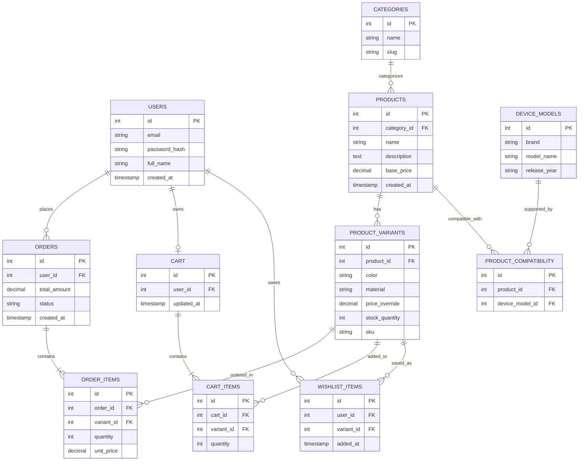

# Sprint 1: System Architecture & Scope Definition

**Project:** CaseVault — Mobile Accessories Store
**Course:** E-Commerce
**Repository:** `/docs/SPRINT_1.md`

---

## Section 1: Target Audience & Market Focus

**Primary Persona:**
Smartphone owners (18–40) who want protective and stylish accessories — cases, screen protectors, chargers, cables, and mounts — specifically matched to their exact phone brand and model. They are frequent upgraders (new phone every 1–3 years) and buy accessories immediately after purchasing a new device.

**Core Pain Point:**
Generic accessory retailers make it hard to know whether a product actually fits a specific device model, leading to wrong-size purchases, high return rates, and shopper distrust. Buyers need a catalog that filters reliably by brand and model rather than one relying on manual product descriptions.

**Domain Scope:**
Mobile Accessories — phone cases, screen protectors, chargers, charging cables, and car/desk mounts. Single-vendor storefront (CaseVault), not a multi-seller marketplace, to keep the build realistic for a semester timeline.

---

## Section 2: MVP Feature Scope Matrix

| Category | Feature Name | Description | Priority |
|---|---|---|---|
| Authentication | User Registration & Authentication | Password hashing and JWT-based authentication mechanism via Supabase Auth. | High (MVP) |
| Catalog | Product Catalog & Device Compatibility Filter | Product browsing with category filtering plus a "select your device" filter that narrows results to compatible accessories. | High (MVP) |
| Cart | Cart Management | Persistent cart state scoped to a specific product variant (color/material), with add/update/delete. | High (MVP) |
| Checkout | Order Processing | Stripe (test mode) payment gateway integration and order object instantiation, decrementing variant-level stock. | High (MVP) |
| Wishlist | Saved Items | Authenticated users can save products/variants to a wishlist for later purchase. | Medium |
| Admin | Inventory Control | Administrative CRUD operations for products, variants, device-model compatibility mappings, and stock levels. | Medium |

Six features total: the four High/MVP items form the core purchase funnel (auth → browse/filter by device → cart → checkout). The device compatibility filter is the domain-defining feature — it's what separates CaseVault from a generic catalog and directly addresses the core pain point in Section 1. The two Medium-priority features add depth without threatening the core deliverable if time runs short.

---

## Section 3: Tech Stack Selection & Justification

**Frontend: HTML, CSS, JavaScript (Vanilla)**
Justification: A vanilla HTML/CSS/JS frontend keeps the build dependency-free and lets the team implement the device-compatibility filter and cart UI using the native DOM and `fetch` API directly against Supabase's auto-generated endpoints. This avoids framework build-tooling overhead, which is a reasonable trade-off for the project's scope, at the cost of more manual DOM/state management as filtering logic grows.

**Backend Infrastructure: Supabase (Backend-as-a-Service)**
Justification: Supabase provides an auto-generated REST API and real-time subscriptions directly over a managed PostgreSQL database, plus built-in authentication and row-level security policies — removing the need to hand-write and host a custom server for standard CRUD operations. This lets the team focus on the harder domain logic (device-compatibility matching, variant stock decrementing) instead of boilerplate route handling.

**Database Management System: Supabase (Managed PostgreSQL)**
Justification: The device-compatibility model is inherently many-to-many — a single case may fit several phone models, and a phone model has many compatible accessories — which requires a proper relational junction table and referential integrity that a document store would push into application code. Since Supabase is PostgreSQL under the hood, the project gets full ACID compliance, foreign key constraints, and row-level security for authorization, fully managed without the team provisioning a database server.

**Caching & Asynchronous Processing (Optional): Supabase Realtime**
Justification: Instead of a separate caching layer like Redis, Supabase's built-in Realtime subscriptions can push live stock-level updates to the frontend (e.g., "only 3 left for iPhone 15") without polling. A dedicated caching/job-queue layer is intentionally out of scope for this MVP given expected low order volume at semester scale.

---

## Section 4: Entity-Relationship Diagram (ERD)

### Relationship & Cardinality Notes

| Relationship | Cardinality | Description |
|---|---|---|
| USERS → ORDERS | 1:N | A user can place many orders; each order belongs to exactly one user. |
| USERS → CART | 1:1 | Each user has exactly one active cart. |
| USERS → WISHLIST_ITEMS | 1:N | A user can save many wishlist items. |
| CATEGORIES → PRODUCTS | 1:N | A category (e.g., "Phone Cases") groups many products; each product belongs to one category. |
| PRODUCTS → PRODUCT_VARIANTS | 1:N | A product (e.g., "Slim Silicone Case") has many variants (color/material combinations), each with its own stock. |
| PRODUCTS ↔ DEVICE_MODELS | N:M | Resolved via `PRODUCT_COMPATIBILITY`. A single case may fit several phone models (e.g., a universal MagSafe charger fits many iPhone models), and a phone model has many compatible accessories. |
| PRODUCT_VARIANTS → CART_ITEMS | 1:N | A specific variant can appear in many carts. |
| PRODUCT_VARIANTS → WISHLIST_ITEMS | 1:N | A variant can be wishlisted by many users. |
| CART → CART_ITEMS | 1:N | A cart contains many cart items. |
| ORDERS → ORDER_ITEMS | 1:N | An order contains many order items (associative entity resolving the N:M between Orders and Variants). |
| PRODUCT_VARIANTS → ORDER_ITEMS | 1:N | A variant can appear across many order items over time. |

**Primary Keys (PK):** `id` on every entity.
**Foreign Keys (FK):** `ORDERS.user_id → USERS.id`, `CART.user_id → USERS.id`, `CART_ITEMS.cart_id → CART.id`, `CART_ITEMS.variant_id → PRODUCT_VARIANTS.id`, `WISHLIST_ITEMS.user_id → USERS.id`, `WISHLIST_ITEMS.variant_id → PRODUCT_VARIANTS.id`, `PRODUCT_VARIANTS.product_id → PRODUCTS.id`, `PRODUCTS.category_id → CATEGORIES.id`, `PRODUCT_COMPATIBILITY.product_id → PRODUCTS.id`, `PRODUCT_COMPATIBILITY.device_model_id → DEVICE_MODELS.id`, `ORDER_ITEMS.order_id → ORDERS.id`, `ORDER_ITEMS.variant_id → PRODUCT_VARIANTS.id`.

**Why the compatibility junction table matters:** `PRODUCT_COMPATIBILITY` resolves the N:M relationship between `PRODUCTS` and `DEVICE_MODELS`. This is the schema decision that directly encodes CaseVault's core value proposition — a shopper filters by their exact device, and the query joins through this table rather than relying on unstructured text matching in a product description.

---

